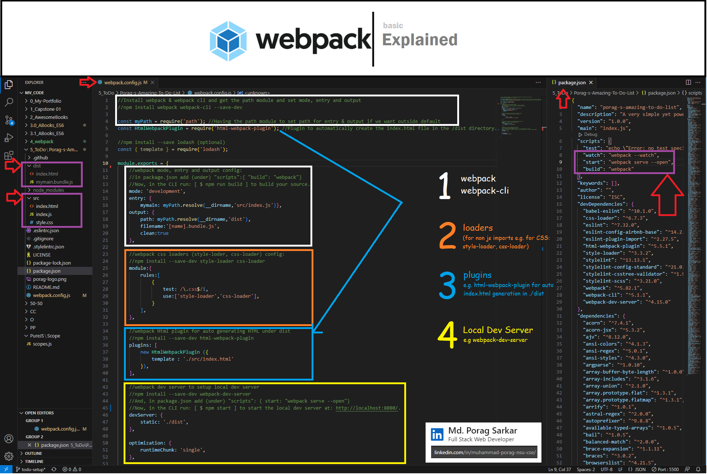

# Porag's Amazing To-do List

  
   
  <h3><b>Porag's Amazing To-do List</b></h3>
  <h5>A very simple yet powerful to-do list built using WEBPACK and served by a WEBPACK DEV SERVER on HTML, CSS, and JS.<h5>

# 📗 Table of Contents

- [📖 About the Project](#about-project)
  - [🛠 Built With](#built-with)
    - [Tech Stack](#tech-stack)
    - [Key Features](#key-features)
  - [🚀 Live Demo](#live-demo)
- [💻 Getting Started](#getting-started)
  - [Setup](#setup)
  - [Prerequisites](#prerequisites)
  - [Install](#install)
  - [Usage](#usage)
  - [Run tests](#run-tests)
  - [Deployment](#triangular_flag_on_post-deployment)
- [👥 Authors](#authors)
- [🔭 Future Features](#future-features)
- [🤝 Contributing](#contributing)
- [⭐️ Show your support](#support)
- [🙏 Acknowledgements](#acknowledgements)
- [📝 License](#license)

# 📖 Porag's Amazing To-do List

This project **Amazing To-do List** is a project demonstrates the use of **HTML & CSS and Javascript Moduler development**. Built using **WEBPACK** and served by **WEBPACK DEV SERVER** A very simple yet powerful to-do list. Along with dynamic modification of the DOM with Events including all the coding best practices. 

## 🛠 Built With 

### Tech Stack 

  
Client

  <ul>
    <li>HTML</li>
    <li>CSS</li>
    <li>JS</li>
  </ul>

   <ul>
    <li>webpack</li>
  </ul>

  
  - **WEBPACK BASICS HIGHLIGHTS**
   

  
Server

  <ul>
    <li>Local webpack dev server</li>
    <li>Optionally can be Deployed Using GitHub Pages</li>
  </ul>

Database

  <ul>
    <li>N/A</li>
  </ul>

### Key Features 

- **Adding a new item.**
- **Removing a selected item.**
- **Marking a selected item as complete.**
- **Removing all items marked as complete at once.**
- **Reordering a selected item (as drag-and-drop) [as an additional feature].**

(<a href="#readme-top">back to top</a>)

## 🚀 Live Demo 

> Please follow the link for a live demo.

- [Amazing To-do List](https://porag-m06.github.io/Porag-s-Amazing-To-Do-List/dist/)

(<a href="#readme-top">back to top</a>)

## 💻 Getting Started 

To get a local copy up and running, follow these steps.

### Prerequisites

In order to run this project you need:
- Git.
- An IDE (e.g. VS Code)
- Browser to run. 

### Setup

Clone this repository to your desired folder:
 - Using Git Bash or any integrated terminal of you choice.
 - Open with code editor (e.g. VS Code).
 - Open the index.html file using any local server (e.g. live server extension in VS Code)

### Usage

To run the project, execute the following command:
- Open the index.html file on a local server on your browser. 

### To add dependencies and run linter tests 

Follow the following:

**************
Initial Step:
**************
- mkdir .github/workflows
- copy the **linters.yml** file to the directory created above.
- touch .gitignore if not created already and add **node_modules/** to it.
- initialize npm to create package.json file by running the command: 
> $ npm i -y      

(here i for install & -y for saying yes to all)

*************
For Webpack:
*************
- To install **Webpack and Webpack CLI**:
> $ npm install webpack webpack-cli --save-dev

- To optaionally install a JS library as an example (e.g. **Lodash**)
> $ npm install --save lodash (optional)

- To install the **HtmlWebpackPlugin** plugin.
> $ npm install --save-dev html-webpack-plugin

- To install **style-loader and css-loader** 
> $ npm install --save-dev style-loader css-loader

- To install the **webpack-dev-server** as a dev dependency (to use live reloading)
> $ npm install --save-dev webpack-dev-server

- List of the commands to run the build (with all the alternatives).

To build and run with the webpack dev server:
> $ npm start

(Will be served at: http://localhost:8080/)

- To build only :
> $ npm run build

(and then may be served using a local server e. g. Live Server in VS Code)

- (Optional Alternatives)
> $ npm run webpack or, $ npm run webpack --mode production

> $ npx webpack

> $ npx webpack --mode production

> $ npx webpack --config webpack.config.js

************************
For Webhint (optional):
************************
- Run
> npm install --save-dev hint@7.x
- To fix validation errors run: 
> npx hint .

**************
For Stylelint
**************
- Run 
> npm install --save-dev stylelint@13.x stylelint-scss@3.x stylelint-config-standard@21.x stylelint-csstree-validator@1.x
- Copy **.stylelintrc.json** to the root directory of your project.

- Run 
> npx stylelint "**/*.{css,scss}" 
on the root of your directory of your project.
- Fix linter errors.

*******
ESLint
*******
- Run 
> npm install --save-dev eslint@7.x eslint-config-airbnb-base@14.x eslint-plugin-import@2.x babel-eslint@10.x
- Copy **.eslintrc.json** to the root directory of your project.

- Run 
> npx eslint .  
on the root of your directory of your project.
- Fix linter errors.

### Deployment
You can deploy this project using:
- GitHub Pages for the main branch. A deployed version can be found here:
https://...

(<a href="#readme-top">back to top</a>)

## 👥 Author 

> Developed by: 

### Author
- GitHub: [@porag-m06](https://github.com/porag-m06)
- Twitter: [@twitterhandle](https://twitter.com/twitterhandle)
- LinkedIn: [LinkedIn](https://www.linkedin.com/in/muhammad-porag-nsu-cse/)

(<a href="#readme-top">back to top</a>)

## 🔭 Future Features 

- **Reordering a selected item (as drag-and-drop) [as an additional feature].**
- **Improve Aesthetics & Design**

(<a href="#readme-top">back to top</a>)

## 🤝 Contributing 

Contributions, issues, and feature requests are welcome!

Feel free to check the [issues page](https://github.com/porag-m06/Porag-s-Amazing-To-Do-List/issues).

(<a href="#readme-top">back to top</a>)

## ⭐️ Show your support 

As a tech enthusiast, your support is always appreciated. If you like this project please do let me know with your support in any way you see fit.

(<a href="#readme-top">back to top</a>)

## 🙏 Acknowledgments 
Inspired by the minimalist website: [web.archive.org](https://web.archive.org/web/20180320194056/http://www.getminimalist.com:80/)

I would like to thank  [Microverse](https://www.microverse.org/) for this project & project guidelines.

(<a href="#readme-top">back to top</a>)

## ❓ FAQ 
- **Can I fork this project?**
  - Yes, feel free to fork and knock yourself out :) . 

- **Can I share this project with others?**
  - Yes, you can share this project for any educational purposes. 

(<a href="#readme-top">back to top</a>)

## 📝 License 
This project is [MIT](./LICENSE) licensed.

(<a href="#readme-top">back to top</a>)

